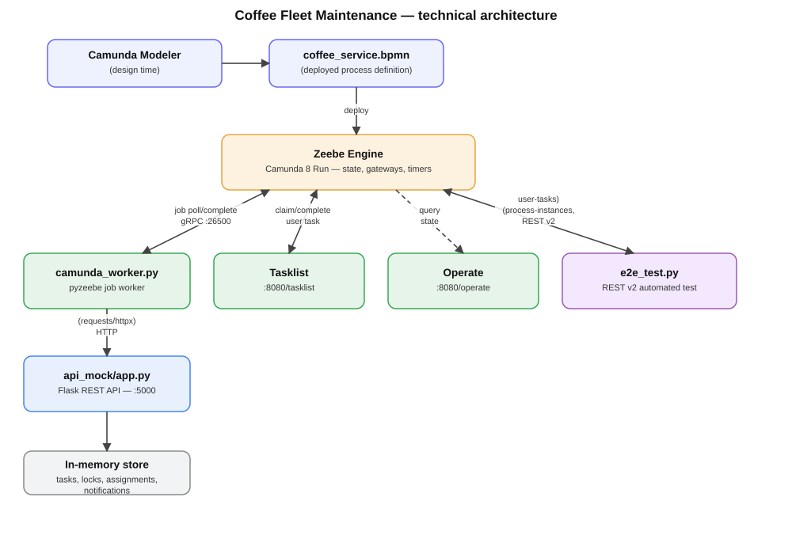
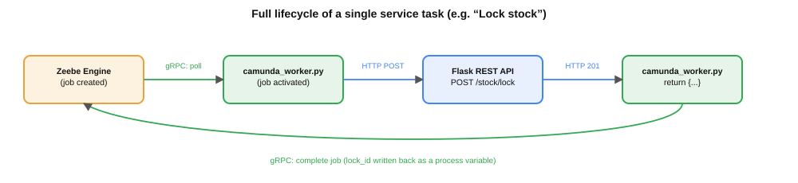

# Architecture — Coffee Fleet Maintenance

This document describes the **execution layer** of the process: how `coffee_service.bpmn` actually runs, which components are involved, and who talks to whom, on which protocol.

---

## 1. Overview

The system is built from four components, each with a single, non-overlapping responsibility:

1. **BPMN diagram** — the static description of the state machine
2. **Zeebe Engine** — the engine that runs that state machine
3. **Python job worker** — the bridge between the engine and real business logic
4. **Flask REST API** — where the actual data and business logic live

---

## 2. Who talks to whom

### 2.1 Camunda Modeler → Zeebe Engine
**When:** at deploy time.
**How:** the Modeler sends the `.bpmn` file to the already-running Camunda 8 Run instance, which registers it as a process definition.
**Note:** this is a one-off, design-time action — the Modeler is not needed at runtime.

### 2.2 camunda_worker.py ↔ Zeebe Engine
**Protocol:** gRPC, default port **26500**.
**Direction:** bidirectional but asymmetric — the worker always **initiates** the interaction (it polls the engine); the engine never calls the worker directly.
**What happens:**
- The worker, via the `pyzeebe` library, continuously asks the engine: *"is there a job available for me, of a given `task_type`?"*
- When it gets one, it runs the registered Python handler function
- The handler's `return {...}` tells the engine the job is done, and which process variables to update

### 2.3 camunda_worker.py → api_mock/app.py
**Protocol:** HTTP (via `httpx.AsyncClient` inside the worker).
**Why it's needed:** the Zeebe engine cannot make HTTP calls on its own from a service task. The worker's handler functions are the only bridge — when a job comes in, the handler calls the Flask API to actually perform the work (create a record, lock stock, allocate a technician, send a notification).

### 2.4 Tasklist ↔ Zeebe Engine
**What it does:** the Tasklist UI (`:8080/tasklist`) shows the open **user tasks** — steps that need a human (e.g. `Repair`, `General cleaning`). When someone assigns it to themselves and completes it, this directly updates the engine's state.
**No worker code involved** — this is a native Zeebe user task mechanism (`zeebe:userTask` marker in the BPMN), completely separate from the job worker path.

### 2.5 Operate ↔ Zeebe Engine
**What it does:** Operate (`:8080/operate`) is **read-only** — it shows, live, where a given process instance is, what its process variables are, and where it might be stuck. This is the main monitoring/diagnostic surface.

### 2.6 e2e_test.py → Zeebe Engine
**Protocol:** REST, Camunda 8's **v2 REST API** (`:8080/v2`).
**What it does:** the automated test script starts process instances (`POST /v2/process-instances`), then claims and completes the open user tasks purely through the API (`POST /v2/user-tasks/{key}/assignment`, `.../completion`) — so a full scenario, from alert to closure, can be driven from a script with zero manual clicking.

---

## 3. One service task, in detail

Every `service`/`sendTask` in the diagram follows the same repeating cycle:

Zeebe never calls the worker directly — the worker polls, executes, calls the REST API, and reports back. This pattern repeats identically for every automated step in the process.

---

## 4. Step-by-step (technical breakdown)

| # | BPMN element | Type | What happens technically |
|---|---|---|---|
| 1 | `Alert received` | start event | Instance starts, with the `alert_type` process variable |
| 2 | `Task created` | serviceTask (`create_task`) | Worker → `POST /tasks` |
| 3 | `Alert type` | exclusive gateway | `alert_type` decides: `material` / `machine_breakdown` |
| 4a | `Required coffee amount locking...` | serviceTask (`lock_stock`) | Worker → `POST /stock/lock` |
| 4a | `Task scheduling` | serviceTask (`schedule_task`) | Internal logic, no REST call |
| 4b | `Error log analysis` | serviceTask (`analyze_error_log`) | Internal logic, no REST call |
| 4b | `Technician allocation` | serviceTask (`allocate_technician`) | Worker → `POST /technician-assignments` |
| 5 | `Notify both` | parallel gateway | Both branches start simultaneously |
| 6 | `Partner notification`, `Technician notification` | sendTask | Worker → `POST /notifications` (twice) |
| 7 | `Repair` | userTask | Tasklist, completed by a human |
| — | boundary timer on `Repair` | non-interrupting timer | After 8 hours without completion → `Customer service notification` |
| 8 | `General cleaning` | userTask (with form) | The `issue_solved` process variable is set here |
| 9 | `Issue solved` | exclusive gateway, **with default flow** | `true` → `Customer confirmation`; `false` or missing → `Detailed description` (safety net) |

---

## 5. REST API reference (`api_mock/app.py`, `:5000`)

| Endpoint | Method | Called by (worker side) | Response |
|---|---|---|---|
| `/tasks` | POST | `create_task` | `task_id` |
| `/stock/lock` | POST | `lock_stock` | `lock_id` |
| `/technician-assignments` | POST | `allocate_technician` | technician name |
| `/notifications` | POST | `notify_partner`, `notify_technician`, `notify_customerservice` | `notification_id` |
| `/health` | GET | — (for checks only) | `{"status": "ok"}` |

Data is currently stored **in memory** (Python dicts) and is lost on restart — a deliberate simplification for a portfolio demo. In a production system this would be a real database (e.g. PostgreSQL).

---

## 6. Job worker — task types (`camunda_worker.py`)

| `task_type` | Does | Calls REST |
|---|---|---|
| `create_task` | Create a record | ✅ |
| `lock_stock` | Lock stock | ✅ |
| `allocate_technician` | Allocate a technician | ✅ |
| `schedule_task` | Scheduling (internal logic) | ❌ |
| `analyze_error_log` | Error log analysis (internal logic) | ❌ |
| `notify_partner` | Partner notification | ✅ |
| `notify_technician` | Technician notification | ✅ |
| `notify_customerservice` | Escalation notification | ✅ |

**Important technical detail:** the `task_type` string must match **exactly** the value entered in the "Task definition type" field in the Modeler — this is the only link between a BPMN element and its Python handler.

---

## 7. User tasks and forms

| Task | Why it's a user task | Form field |
|---|---|---|
| `Repair`, `General maintenance`, `Material refilling` | Physical work | — (simple completion) |
| `General cleaning` | Where "was it resolved?" is decided | `issue_solved` (select: `true` / `false`) |
| `Customer confirmation` | Human approval | — |
| `Detailed description` | Documenting an unresolved case | text field |

User tasks are **native Zeebe user tasks** (`zeebe:userTask` marker) — no job worker is required; Tasklist talks directly to Zeebe.

---

## 8. Running order

1. `python api_mock/app.py` — start the REST API (`:5000`)
2. `python camunda_worker.py` — start the job worker (gRPC connection to `:26500`)
3. Deploy the diagram from the Modeler (or it's already deployed)
4. Start an instance — from the Modeler, from Tasklist, or via `python e2e_test.py`
5. Handle open user tasks in Tasklist (`:8080/tasklist`)
6. Follow progress in Operate (`:8080/operate`)

---

## 9. Why it's built this way

- **Why a worker if there's a REST API?** Because Zeebe cannot make an HTTP call directly from a BPMN service task — a job worker is the only way to bring an external system (an API) into the process.
- **Why a `default flow` on the "Issue solved" gateway?** If the `General cleaning` form somehow doesn't set `issue_solved` (missing data, a test instance), the engine would throw an error at the gateway — the default flow routes such cases safely to "not resolved" instead of halting.
- **Why non-interrupting on the `Repair` boundary timer?** The goal is only a warning notification (escalation), not stopping the work — the technician can keep working while the manager has already been notified of the delay.
- **Why no AI integration in this case?** Because the alert type arrives as structured data (not free text), so a plain exclusive gateway (if/else) solves it exactly as well as an LLM call would — adding AI here would be unjustified complexity, not a real improvement.

---

## 10. Glossary

| Term | Meaning |
|---|---|
| **Job** | A concrete unit of work the Zeebe engine creates for a given `task_type` |
| **Job worker** | An external program that polls Zeebe for jobs of a given `task_type` and performs them |
| **Process instance** | One concrete, currently-running instance of the process (e.g. the lifecycle of a single alert) |
| **Process variable** | Data held in the process's state, read by gateways and written by workers/user tasks |
| **Default flow** | The branch on a gateway that runs when no other condition is true |
| **Tasklist** | Web UI for handling open user tasks |
| **Operate** | Web UI for monitoring running/completed process instances |

---

*This document describes the current, tested state of the system (both main branches — `material` and `machine_breakdown` — have been run end-to-end via automated test, reaching `COMPLETED`).*
