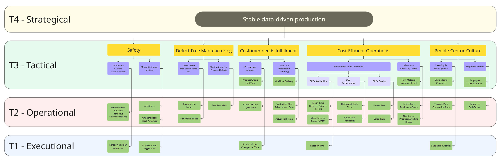

# Methodology: KPI Tree & Tiered Daily Management

## The problem this addresses

Starting up a new production line is a well-documented challenge, even
when following current industry best practice. Two failure patterns
show up repeatedly:

- **Cross-functional disagreement on priorities** — different
  departments optimize for different things, with no shared reference
  point for what matters most right now.
- **Incomplete or inconsistent data** — because processes aren't yet
  standardized, the same underlying event (a stoppage, a defect, a
  delay) gets recorded and reported as different numbers by different
  people or departments.

This framework is a starting point, not a finished system: a KPI
structure and reporting cadence designed to be usable from day one of
ramp-up, and adapted to specific needs as the line matures.

A KPI-driven management approach makes it possible to monitor processes
effectively, catch deviations early, and act on them in a targeted way.
That requires two things working together: a coordinated data-collection
system, and a measurable, trackable structure that keeps improvement
efforts pointed in the right direction over the long term.

## KPI tree structure

The tree is hierarchical, breaking a single high-level company objective
down into segments that are understandable and actionable at every
level of the organization. This isn't just a reporting convenience — it
supports a shared sense of ownership across teams, which indirectly
improves engagement.

The same four tiers structure both the KPI tree's depth and the
meeting cadence described later in this document — a metric's tier
determines who owns it and which meeting it gets discussed in:

| Tier | Level | What lives here |
|---|---|---|
| **T4** | Strategical | The single top-level company objective |
| **T3** | Tactical | The five SQDCP pillars and their tactical goals (e.g. "Efficient Machine Utilization", "Accurate Production Planning") |
| **T2** | Operational | Mid-level metrics owned by shift leads and support functions (e.g. MTBF, MTTR, Bottleneck Cycle Time, Scrap Rate) |
| **T1** | Executional | Shop-floor-level metrics captured directly by operators (e.g. Reaction Time, Safety Walks per Employee, Suggestion Activity) |



The tree is a general-purpose starting template, not a finished,
company-specific instrument. Applying it in practice requires: an
accurate read of the current state, realistically achievable
short-term targets, and an explicit view of the expected trend. For
each KPI actually put into use, four things need to be defined
precisely: its purpose, its exact definition, how it's measured, and
its target value.

### Company objective and supporting strategy

For a new production system, the immediate high-level goal is a fast,
efficient ramp-up. This framework extends that goal one level further:
the ramp-up should happen inside a **stable, sustainable framework**
that also builds the data-driven decision-making mindset the
organization will need — which in turn prepares the ground for future
digital systems to be adopted and trusted.

**Company objective:** *Stable and efficient data-driven production
ramp-up.*

This objective is broken down into five strategic pillars, following
the **SQDCP** framework (Safety, Quality, Delivery, Cost, People). A
**Balanced Scorecard** approach is used to track each pillar's current
state, since it allows metrics to be weighted by importance and given
category-specific target values, rather than being compared on a single
flat scale.

| Pillar | Strategic direction |
|---|---|
| **Safety** | Build an environment where people look out for their own and their colleagues' physical wellbeing, and proactively flag safety/ergonomics improvements. |
| **Quality** | Get products right the first time; reduce start-of-run quality defects. A key lever for both cost efficiency and customer satisfaction. |
| **Delivery** | Meet customer requirements through supply-chain efficiency and single-piece flow, which in turn optimizes inventory levels. |
| **Cost** | Make production losses visible, point to improvement areas, and steer improvement projects. |
| **People** | Build a motivating culture centered on employee engagement, involvement, and continuous development. |

## The five pillars in detail

### Safety

Two tactical goals support the safety pillar:

- **"Building a Safety First culture"** — establishing a shared,
  supportive mindset around safety. Measured through voluntary safety
  walks and instances of missing PPE (personal protective equipment)
  usage. Both metrics support ongoing safety awareness and, over time,
  surface improvement suggestions.
- **"Improving workplace safety"** — monitors incidents and their
  severity, including unauthorized work activities and near-misses.
  Combined with improvement suggestions raised during safety walks,
  this feeds a concrete improvement plan. Resolving flagged and
  potential hazards doesn't just make the workplace safer — it also
  strengthens the safety culture and improves overall satisfaction.

### Quality

Focused on avoiding quality problems from the very start of production,
and minimizing them as production continues.

Under **"Defect-free line start"**, quality defects are split into two
root causes:

- **Raw material defects** — reduced in likelihood through upfront
  inspection.
- **Equipment/parameter issues** — if raw material meets spec, a
  properly set-up machine should ideally produce a good first part.
  The **first-sample defect rate** is tracked specifically to validate
  whether machine parameters are set correctly; under stable material
  specs, machine parameters should stay close to constant.

Once the line is running, further fine-tuning is often still needed —
for example, an imperfectly executed repeat process step, or the need
for re-testing. This is tracked through the **first-pass yield** metric
(rate of products manufactured correctly on the first attempt).

### Delivery

One of the most business-critical pillars, since it directly drives
revenue. Meeting customer demand requires accurate production planning,
tracked through:

- **On-time delivery**
- **Production plan attainment rate**
- **Current cycle time**

These three metrics represent the customer-facing view: what the
customer actually needs and expects.

The complementary, production-facing view is captured under **"Known
production capacity"** — the actual, experience-based capability of the
line. This tracks cycle time, throughput time, and changeover time per
product group, giving a realistic picture of *"what speed could we run
at if everything went right"* — useful as a feedback signal on current
line capability, though not sufficient on its own to build a realistic
production plan.

### Cost

Built around the most consequential single metric in this pillar:
**Overall Equipment Effectiveness (OEE)**.

```
OEE = Availability × Performance × Quality

Availability = Actual production time / Planned production time
Performance  = Actual production speed / Planned production speed
Quality      = Good units produced / Total units produced
```

Because OEE is a product of three components, it can show values below
10% on a newly started line, driven mainly by frequent stoppages — and
because it's a product, a low aggregate score doesn't by itself tell
you *where* the problem is. Each component is therefore tracked as its
own sub-goal:

**Availability** (typically the most critical component early on,
since it captures downtime):
- Reaction time
- Mean Time Between Failures (MTBF)
- Mean Time To Repair (MTTR) — measured from the start of a repair to
  the first good part produced afterward

A standardized data-capture format, broken down by equipment and fault
category, is essential here. Root cause and resolution need to be
logged for every event — this data becomes the foundation for a future
troubleshooting knowledge base, and provides insight into fault
patterns and cross-department effectiveness.

**Performance** — once the machine is running, two further loss sources
apply:
- **Bottleneck cycle time** — the slowest step sets the line's maximum
  speed.
- **Cycle time variance** — how balanced the line is overall; a useful
  reference point for progress toward single-piece flow.

**Quality** — tracked through:
- **Scrap rate**
- **Re-test rate** — units that pass through a station more than once
  before meeting quality requirements

**Cost/inventory** is tracked separately through a **"Minimum inventory"**
tactical goal, covering raw material stock (best tracked in days of
production supply), finished-goods inventory, and units pending rework
— all of which tie up capital and need to be kept within defined
bounds.

### People

Included as a strategic pillar because skilled-labor recruitment and
retention is a live constraint for most manufacturers today — commuting
and relocation for work are increasingly normal, which raises the
stakes on this pillar.

- **"Learning and development"** — tracks individual growth and
  self-actualization, primarily through **training plan completion**,
  which team leaders need to actively monitor. When headcount turnover
  is high, the skills matrix needs to be re-reviewed and people
  re-trained accordingly — gaps here directly hurt team and process
  performance.
- **"Suggestion activity"** — once baseline production requirements are
  met, this tracks how actively frontline employees propose
  improvements. They're best positioned to spot problems, since they
  live the process every day.
- **"Employee morale"** — distinct from the training/competency
  angle above, this tracks team mood and workload. **Employee
  satisfaction** can be captured through simple tools like mood markers
  on the line board, making problems and workload-driven stress easier
  to spot early. **Turnover rate** adds visibility into how competitive
  alternative employers in the area are.

## Data capture: the line board

Early in a production ramp-up, digital systems are rarely mature or
reliable enough to lean on — manual data capture is the operational
backbone. Getting this standardized from the start matters, so the
resulting data stays usable, searchable, and comparable later on.

The **line board** is the key tool here — the single surface where the
most important production data is visible, current, and quickly
scannable for both operators and supervisors.

**T0 — operator level:** production quantities and the reason for any
deviation. Detailed root-cause analysis isn't expected at this level
(that's the shift lead's job) — but one addition is worth making: a
simple flag for whether the operator resolved the issue themselves. The
reasoning: if an operator fixes something on the spot, that event often
never gets logged as downtime at all, since they can't leave the
machine unattended to record it.

**T1 and above:** production volumes plus lost-production quantities
and their causes take center stage. This is what surfaces recurring
blockers and their frequency — indirectly pointing at improvement
priorities. Logged by the shift/team lead, working with supporting
departments, and kept continuously up to date.

Beyond these two data blocks, the line board should also carry:

- Line layout and shift staffing (who's working which station)
- Escalation process — who's responsible for what, on-call contacts
- Training plan overview
- Morale tracking (e.g. magnetic mood markers)
- Shift-related bonus tracking, broken down by component, to keep
  individual contribution transparent (e.g. problems resolved,
  suggestions submitted)

If a problem needs deeper analysis than the line board supports, it
gets escalated into the plant's long-term action-tracking system —
and, longer-term, even this kind of data should move into a digital
format.

## KPI definition and data governance

Consistent, high-quality data requires discipline at both the capture
and calculation stages — simple in theory, harder in practice.

For each metric, the calculation method and the departments involved
need to be explicitly defined. Adoption is much easier with a
dedicated structure: **a coordinator, plus one designated point of
contact per department.** The coordinator owns KPI definitions and
documentation and designs the data-collection approach; once that's in
place, the team gathers the variables each calculation depends on and
assigns owning departments.

For an early-stage system, the fastest and most stable rollout option
is typically a **cloud-hosted, collaboratively editable spreadsheet.**
Each department's point of contact is responsible for accurate input
data; the coordinator owns the calculations and underlying
infrastructure. Access can be restricted by role, which keeps
responsibilities clear — but a shared calculation standard isn't
enough on its own: training and stakeholder buy-in matter just as much
as the technical setup.

## Meeting cadence: Tiered Daily Management (TDM)

The KPI tree's four tiers (Executional → Operational → Tactical →
Strategical) are paired with a **Tiered Daily Management** meeting
structure that mirrors them: every level of the organization sees the
metrics that are actually relevant to them, and problems flow both
**vertically** (up and down tiers) and **horizontally** (across
departments).

### T1 (Executional) — daily stand-up
Operators and shift leads. A short (10–15 min) start-of-shift meeting
focused on the previous shift's performance and issues affecting
current production: schedule adherence, scrap rate, morale.

### T2 (Operational) — shift/mid-level meetings
Held roughly an hour into the shift (~1 hour). Attendees: shift lead
plus problem-resolution stakeholders (maintenance, quality). Covers a
full review of the previous shift, including a detailed walk-through
of the line board: temporary vs. long-term fixes, downtime root
causes, and re-prioritizing open issues. Metrics from every strategic
branch of the tree can surface here — but only critical points are
actually discussed.

Department-level daily stand-ups also happen at this tier: shorter,
purely informational meetings covering individual priorities, daily
production targets, and training-plan updates.

### T3 (Tactical) — senior leadership meetings
The last meeting of the day, attended by group/area leads. Focused on
collecting critical, unresolved issues and escalating them — this sets
the day's focus at the leadership level. Cross-department improvement
and problem-solving project meetings also sit at this tier: issues that
have already been escalated to department level and need further
support. These are scheduled in the afternoon and organized across the
week by SQDCP theme, so each strategic pillar gets dedicated, protected
time weekly:

| Day | Category | Focus topics / KPIs |
|---|---|---|
| Monday | Safety | Incidents, safety walks, PPE usage |
| Tuesday | Quality | First samples, scrap rate, raw material defects |
| Wednesday | Delivery | Cycle times, delivery accuracy, plan attainment |
| Thursday | Cost | OEE components, downtime, inventory optimization |
| Friday | People | Training, suggestions, employee satisfaction |

Each strategic pillar has an owner responsible for scheduling that
day's meeting and bringing in the right subject-matter experts.

### T4 (Strategical) — senior leadership / director-level meeting
A weekly summary meeting for top management, covering conclusions from
the T3 meetings and measuring the results of actions already taken.
Functions as preparation for the plant's operations director: a
consolidated view of where each strategic pillar stands and how it's
trending.

## Relationship to the rest of this portfolio

This framework defines the **organizational and governance layer**:
what gets measured, who owns it, and how it's reviewed. The
[`manufacturing_simulation/`](../manufacturing_simulation) case study
addresses the **technical/analytical layer** on top of the same
production-ramp-up problem: modeling machine-level OEE, MTBF, and MTTR
through discrete-event simulation, to answer capacity and bottleneck
questions before committing to a real production plan. Together, they
cover both halves of the same original thesis.
